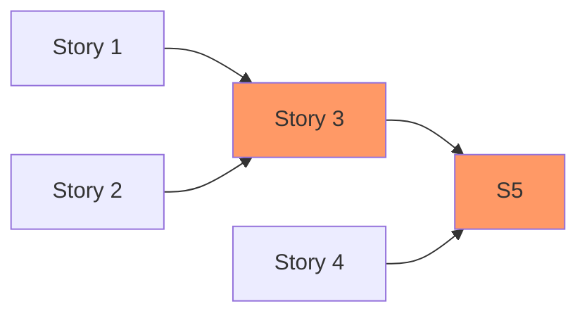
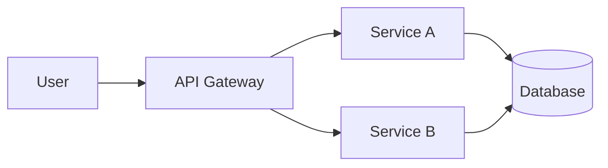
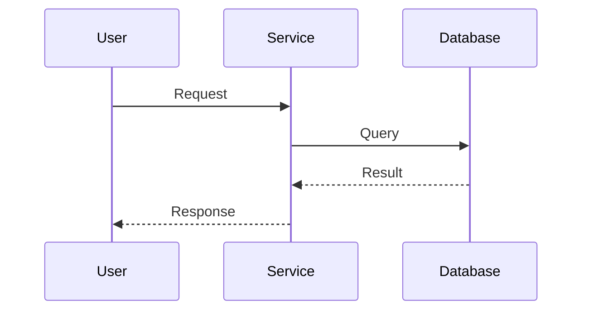
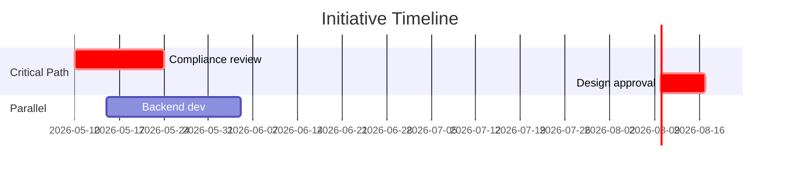

# Skill: Visual Storytelling

## Standards used

- `references/visual-output-format.md` — design system, diagram types, when to use which format
- `references/templates/flowchart.html` — flowchart template (other templates added as needed)

If standards conflict with skill-specific guidance below, the standard wins.

## Description

The Visual Storytelling skill owns the generation of visual artefacts across the
initiative lifecycle: diagrams, charts, one-page summaries, dependency maps,
stakeholder grids, progress dashboards, journey maps, and playback decks. It is
invoked by other skills when they need a visual output, or directly by the user
when they need to communicate something visually.

The goal is not "make a diagram" — it is **to tell a story visually**. Every
visual must earn its place by communicating something that text alone cannot.

## When to invoke

- Another skill needs a visual output (Feature Slicing → dependency diagram,
  Solution Shaping → architecture, Stakeholder Strategy → influence map,
  Playback → one-pager, Critical Path → Gantt, Risk & Tracker → dashboard)
- The user asks for a diagram, chart, visual, or "show me"
- The user is preparing a stakeholder communication that needs visual support
- A document is being written for PM/exec audiences (visuals dramatically
  improve comprehension)
- Comparing options, alternatives, or scenarios — a side-by-side visual
  beats a wall of text every time
- The user says "this doc isn't hitting the mark" or "this needs to be
  more visual"

## Core principle

**Tell a story, not just display data.**

A visual must answer a specific question or anchor a specific decision. If a
visual is a generic template that could apply to any initiative, it doesn't
belong. Every diagram, chart, or layout should be tightly anchored to the
content it represents.

## The storytelling framework

For any narrative-driven visual (one-pagers, playback decks, status comms),
structure the story as:

1. **Problem** — what is the situation, who experiences it, why does it matter?
2. **Evidence** — what do we know, what data backs this up, what was investigated?
3. **Choice** — what are the options, what's recommended, what was rejected?
4. **Consequence** — what happens if we proceed, what changes, what stays the same?
5. **Ask** — what decision is needed, from whom, by when?

Not every visual needs all five — but the story arc should be visible.

## Visual types and when to use each

### 1. Initiative one-pager
**When:** PM/exec stakeholders need to understand an initiative quickly.
**What it shows:** Problem statement → stakeholder impact → gap vs future state → solution at a glance → success metrics → key blockers.
**Format:** HTML/SVG widget (for screenshot/embed) or static SVG for slide decks.
**Watch for:** Too dense — must be readable in under 60 seconds.

### 2. Current state architecture (Mermaid)
**When:** Solution shaping, technical discovery, onboarding new engineers to the system.
**What it shows:** Services, data stores, integration points, external dependencies.
**Format:** Mermaid `flowchart` or `graph LR/TD`.
**Watch for:** Too detailed — keep to the boxes that matter for the initiative.

### 3. Future state architecture (Mermaid)
**When:** Solution shaping, ADR documentation, playback.
**What it shows:** Same shape as current state but with the proposed changes highlighted.
**Format:** Mermaid. Use colour or notation to mark what's new vs unchanged.

### 4. Sequence diagram (Mermaid)
**When:** Documenting a specific flow or interaction across services.
**What it shows:** Actors and the messages between them in chronological order.
**Format:** Mermaid `sequenceDiagram`.
**Watch for:** Don't use for everything — only when sequence actually matters.

### 5. Dependency diagram for feature slices
**When:** After Feature Slicing produces a slice list.
**What it shows:** Slices as nodes, dependencies as edges, critical path highlighted, parallel tracks visible.
**Format:** Mermaid `flowchart LR` with classes for criticality.
**Watch for:** Show what blocks what — not just what exists.

### 6. Stakeholder influence × interest grid
**When:** Stakeholder Strategy.
**What it shows:** 2×2 grid with stakeholders placed by influence and interest, engagement strategy per quadrant.
**Format:** SVG widget (better than Mermaid for spatial accuracy).
**Watch for:** Anchor placement in evidence, not impressions.

### 7. Progress dashboard
**When:** Risk and Tracker `/snapshot` and `/summary`.
**What it shows:** Phase %, confidence scores (current vs previous), risk count trend, sign-off rate, overdue items.
**Format:** HTML/SVG widget.
**Watch for:** Don't display everything — highlight what changed and what needs attention.

### 8. Gantt-style timeline
**When:** Critical Path and Priority — date-sensitive initiatives.
**What it shows:** Items on a timeline with dependencies, critical path highlighted, slack visible.
**Format:** Mermaid `gantt` or SVG widget.
**Watch for:** Show slack and risk explicitly — not just the bars.

### 9. Side-by-side option comparison
**When:** Solution Shaping has multiple options to compare.
**What it shows:** Two or three options as parallel columns with the same dimensions for each (pros, cons, effort, risk).
**Format:** HTML/SVG widget or Mermaid mindmap.
**Watch for:** Same dimensions for each option — apples to apples.

### 10. Decision tree (for ADRs)
**When:** Documenting a non-trivial decision with branching consequences.
**What it shows:** The decision question, options, consequences of each.
**Format:** Mermaid `flowchart`.
**Watch for:** Keep to one decision per tree.

### 11. Journey map (current vs future)
**When:** UX/service design work, operational process changes.
**What it shows:** Steps a user takes, pain points highlighted, future state side by side.
**Format:** SVG widget.
**Watch for:** Map the actual flow, not a sanitised version.

### 12. Risk heatmap
**When:** Risk & Tracker — when there are 5+ risks.
**What it shows:** Risks plotted by probability × impact, mitigation status indicated.
**Format:** SVG widget.
**Watch for:** Don't just plot — show what's been mitigated and what's still open.

## Output format
Visuals conform to `references/visual-output-format.md`. Default to interactive HTML using the appropriate template in `references/templates/`. Mermaid is a fallback only.

When producing a visual:
1. Read `references/visual-output-format.md` for the format decision (Section 8 — Embedding in Confluence)
2. Pick the diagram type from Section 4
3. Read the corresponding template in `references/templates/<type>.html`
4. Fill in the template's header, stats bar, SVG nodes/edges, and `nodes` JS object
5. Save to `<initiative-folder>/visuals/<slug>.html`
6. If publishing to Confluence, also generate a PNG screenshot for inline preview

## Two modes

**Quick mode** — user asks for a specific visual, content is clear, destination
implied. Skip the clarifying questions, generate, output. Self-critique is a
one-liner.

**Deep mode** — user is preparing a stakeholder communication, narrative
visual, or multi-section artefact. Clarify question/audience/destination first,
apply full storytelling framework, full self-critique.

Default to quick mode unless the visual is narrative (one-pager, playback deck,
status comms) or the request is vague.

## Tasks

1. **Clarify the question** (deep mode only) — what specific question is this
   answering? Who is the audience? Where will it live?
2. **Pick the right type** — match the question to one of the visual types above.
3. **Anchor in content** — pull the actual content from the initiative tracker,
   requirements, or solution options. Never generate a generic template.
4. **Draft the visual** — produce the Mermaid code or SVG widget code based
   on destination.
5. **Apply the storytelling framework** (narrative visuals only) — check that
   problem/evidence/choice/consequence/ask are visible.
6. **Self-critique** — does this visual answer the question? Is it readable
   in under 60 seconds? Does it earn its place vs the text?
7. **Output and offer iteration** — produce the visual with a one-line
   description, plus an offer to iterate ("want this in a different format,
   or with different emphasis?")

## Iteration loop

Visuals rarely land perfectly first time. Always offer iteration:

- "Want this with more detail / less detail?"
- "Want this in a different format (Mermaid vs widget vs SVG)?"
- "Want the emphasis to shift (e.g., highlight risks vs highlight progress)?"

If the user pushes back ("this isn't hitting the mark"), don't just regenerate
the same thing differently — ask what specifically isn't working. Common
failures:
- Wrong level of detail
- Wrong story emphasis
- Wrong format for the destination
- Generic when it needed to be specific

## Quick reference — Mermaid syntax for the most common cases

**Dependency diagram (slices/stories):**


**Architecture (current state):**


**Sequence diagram:**


**Gantt (critical path):**


## Typical questions to ask

- What specific question is this visual answering?
- Who is the audience — PM, exec, engineering, ops, BA?
- Where will it live — Confluence, chat, slides, doc?
- What decision does it support?
- Is there an existing visual that should be updated rather than replaced?
- What level of detail is right for the audience?

## Output guidelines

For each visual produced:

```
What this shows: <one line>
Audience: <who it's for>
Destination: <where it goes>
Format: <Mermaid / SVG widget / etc>
[The visual code or rendered widget]
Self-critique: <what would a reviewer push back on?>
```

For multi-visual outputs (playback deck, one-pager with multiple sections):
sequence the visuals using the storytelling framework — each visual moves the
narrative forward.

## Challenge rules

- **Earn its place** — if a visual just duplicates the text, don't produce it.
  Either replace the text with the visual, or skip the visual.
- **Specific over generic** — every visual must reflect the actual content of
  this initiative. Generic templates fail.
- **Right format for destination** — Confluence wants Mermaid, chat wants
  widgets, slides want SVG. Don't force a format that doesn't fit.
- **Story over decoration** — if the visual is pretty but doesn't communicate
  a decision or finding, redo it.
- **Self-critique** — after generating, ask: what would a senior reviewer push
  back on? Surface that critique transparently.

## Integration with other skills

| Invoking skill | Visual produced |
|---|---|
| Intake Reviewer | Initiative one-pager (lean version) |
| Kickoff Preparation | One-page kickoff brief |
| Discovery & Requirements | Current state architecture, journey map |
| Feature Slicing & Sequencing | Dependency diagram with critical path |
| Solution Shaping | Future state architecture, side-by-side option comparison |
| Delivery Definition | Epic/story dependency diagram |
| Playback & Enablement | Full one-pager + playback deck visuals |
| Risk & Tracker | Progress dashboard, risk heatmap |
| Stakeholder Strategy | Influence × interest grid |
| Critical Path & Priority | Gantt-style timeline |

## What this skill does NOT do

- Does not write text content — pulls existing content from other skills
- Does not make decisions about which option to recommend — shows the options
- Does not replace narrative — complements it
- Does not generate visuals for their own sake — every visual must answer a
  question or support a decision

## Failure modes

| Failure | What it looks like | Mitigation |
|---|---|---|
| Generic template | Visual could apply to any initiative | Anchor every element in this initiative's content |
| Decoration not communication | Pretty but doesn't tell anything | Self-critique: what decision does this support? |
| Wrong format for destination | Confluence page with an HTML widget | Confirm destination first, pick format accordingly |
| Over-dense | Can't be read in under 60 seconds | Strip to the elements that earn their place |
| Duplicates the text | Same information in two forms | Replace text with visual, or skip the visual |
| Missing story arc | Just a chart, no narrative | Apply the storytelling framework |
